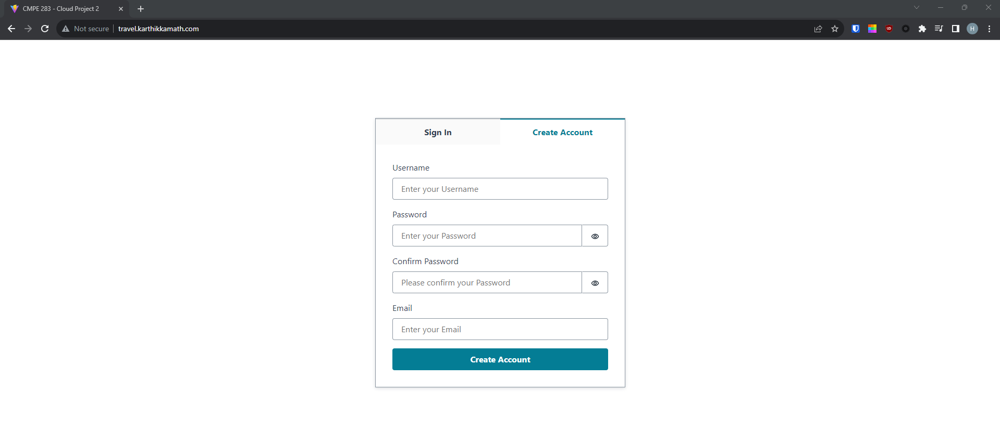
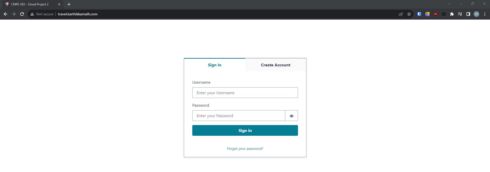
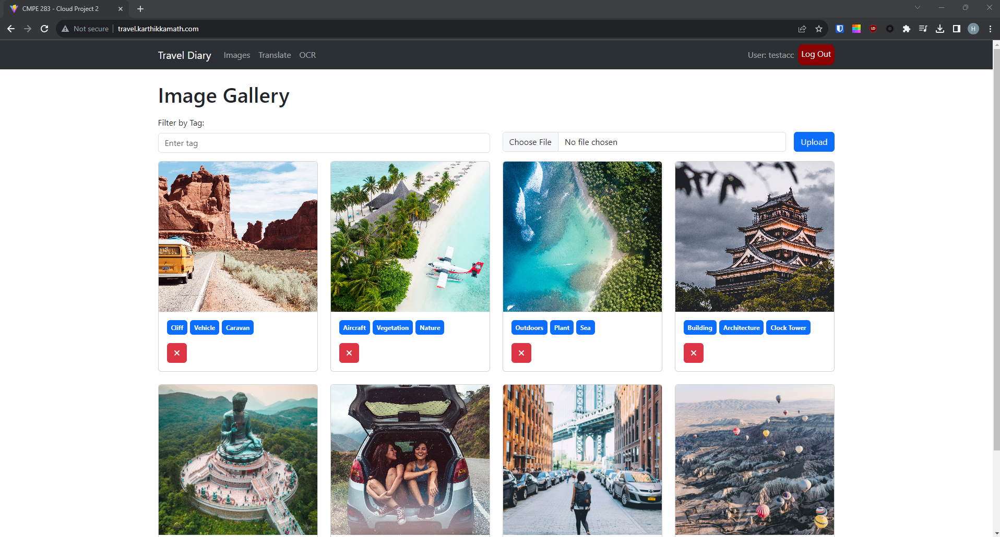
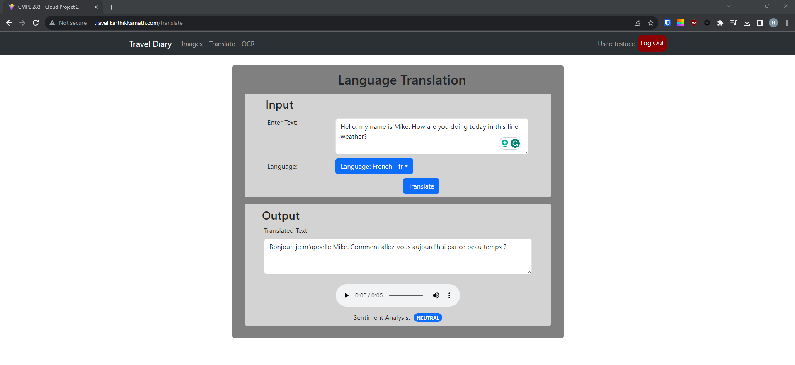
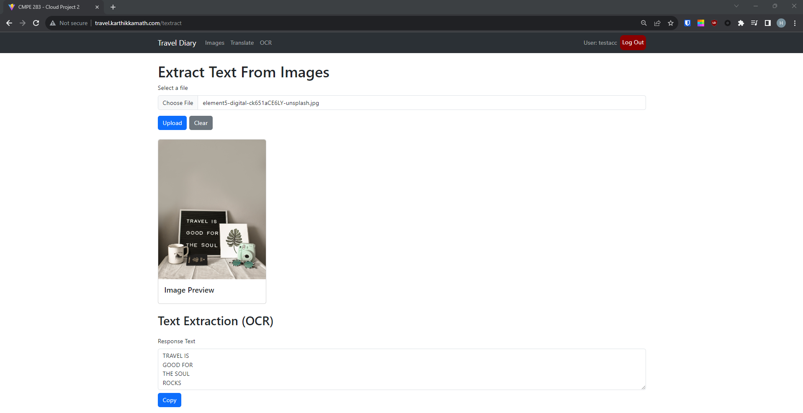
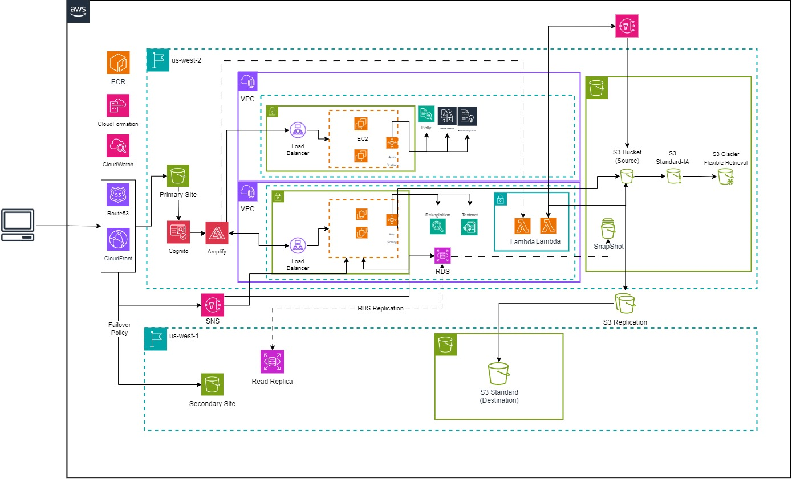

<div align="center">
 
  <h1 align="center">Travel Diary: CMPE281 -  Cloud Project #2 </h1>

  <p align="center">
    <a href="http://travel.karthikkamath.com/">View Demo</a>
  </p>
</div>


 

---

*	University Name: http://www.sjsu.edu/ 
*	Course: [Cloud Technologies](https://catalog.sjsu.edu/preview_course_nopop.php?catoid=13&coid=116077)
*	Professor: [Sanjay Garje](https://www.linkedin.com/in/sanjaygarje/)
*	Students: 
    - [Harshil Vyas](https://www.linkedin.com/in/harshil-vyas/)
    - [Miyar Karthik Kamath]()
    - [Mohith Gowdaa]()
    - [Ahmed Zaytoun]()
    

## Project Introduction:
### Project Objective:

Travel diary application that goes beyond the traditional pen-and-paper format. This digital platform allows users to store and view images related to their travel experiences. What sets this application apart is its integration of artificial  intelligence (AI) and machine learning (ML) models for image analysis, along with features like text translation and sentiment analysis.

The project's impact lies in offering a comprehensive and intelligent solution for documenting travel experiences. It goes beyond the basic functionalities of traditional travel diaries by leveraging AI to organize, translate, and add emotional context to entries. The application's relevance is evident in its ability to address common challenges faced by travelers, making it a valuable tool for those seeking a more enriched and technologically advanced way to capture and remember their journeys. The potential societal impact, through enhanced cultural understanding, adds an additional layer of significance to the project.


### Features
- Image Analysis
- Image Categorization
- Text Translation
- Audio Pronunciation
- Sentiment Analysis
- Optical Character Recognition
- File Cloud Storage

## Sample Demo Screenshots

### Creating a new Account


### Login into Account


### Home Page (Image Analysis and Tagging)


### Text Translate


### Optical Character Recognition (Extract Text From Images)


### Architecture Diagram


## Pre-requisites Set Up

### Cloud Configuration
Before running the project, make sure to set up the following resources in your cloud account:

- IAM User (With appropriate permissions)
- S3 Bucket
- CloudFront Distribution
- RDS
- AWS Cognito (from CLI / CloudFormation)
- EC2
- Load Balancer
- Auto Scaling Groups
- Route 53
- AWS Lambda (from CLI / CloudFormation) 
- SNS
- [Other relevant cloud services]

### Local Software Requirements
Make sure you have the following software installed on your local machine:

- NodeJS
- NPM 
- AWS CLI
- AWS Amplify CLI
- VSCODE IDE 
- IntelliJ
- MySQL WOrkbench
- PostMan

## Local Configuration

### Setting Up Cloud Credentials Locally
1. Create IAM User 
2. Grant Admin Access to Manage and Create Resources
3. Create access keys (remember to save them)
4. Configure Amplify with IAM User 

    ```bash
    $ amplify configure
    ```

### Local Project Configuration
[Provide instructions on how to configure the project locally, if applicable]

## How to Set Up and Run the Project Locally

1. **Clone the Repository:**

```bash
$ git clone https://github.com/Harshil-V/CMPE281-Cloud-Project-2

$ cd CMPE281-Cloud-Project-2
```

### Frontend
<h4>1. Change Directory to /frontend</h4>

```bash
$ cd frontend
```

<h34>2. Install Dependencies</h34> 

```bash
$ npm i # or npm install
```

<h4>3. Initialize Amplify</h4>

```bash
$ amplify init # complete the steps
```

<h4>4. Add Amplify Auth</h4>

```bash
$ amplify add auth # complete the steps
```
> Note: Use 'Default configuration' and 'Sign In with Username'

<h4>5. Push to Publish AWS Resouces Config for Frontend</h4>

```bash
$ amplify push 
```
> Note: This uses CloudFromation

<h4>6. Make any change to API Endpoint on the code</h4>

```bash
$ npm run dev # application will be accessible at `http://localhost:5173/``
```
> Note: Update `baseURL` where needed


### Backend (Spring Boot) 

> Note: Have a JDK installation on your system. Either set the JAVA_HOME environment variable pointing to your JDK installation or have the java executable on your PATH.

> This project uses JDK 11. To check your JDK version installed locally:

```bash
$ java -version
```

<h4>1. Change Directory to /backend</h4>

```bash
$ cd frontend
```

<h4>2. Run the below Maven cmd </h4>

```bash
$ mvn clean install
```

<h4>3. Run the below Maven cmd to create a jar in target folder</h4>

```bash
$ mvn clean package
```

<h4>4. To run the Spring boot application using jar </h4>

```bash
$ java -jar target/travel-app-0.0.1-SNAPSHOT.jar
```

<h4>5. To run the Spring boot application using Maven </h4>

```bash
$ $ mvn spring-boot:run
```

### Backend (nodeJS)
<h4>1. Change Directory to /NLPfunctionality</h4>

```bash
$ cd NLPfunctionality
```

<h34>2. Install Dependencies</h34> 

```bash
$ npm i # or npm install
```

<h35>3. Open Code Editor and create a .env file</h35> 

<h36>4. Add values to 
AWS_ACCESS_KEY_ID 
AWS_SECRET_ACCESS_KEY 
AWS_DEFAULT_REGION</h36> 

```bash
$ npm run dev # application will be accessible at `http://localhost:4000/``
```
